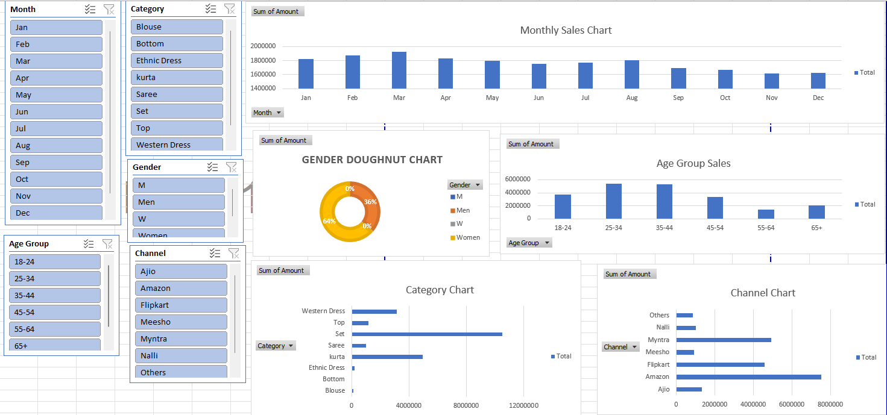

Here is the **final clean COPY-PASTE version** of your detailed README — no extra spacing, no formatting issues, just select → copy → paste into GitHub.

---

## Retail Sales Analysis Dashboard

A fully interactive and visually appealing Excel dashboard designed to analyze retail sales performance, monitor business KPIs, and uncover actionable insights. This project demonstrates end-to-end data cleaning, preparation, and dynamic dashboard creation using Microsoft Excel.

---

## Overview

This project presents a comprehensive Retail Sales Dashboard built using Excel Pivot Tables, Pivot Charts, Slicers, and KPI cards. It allows users to quickly understand business performance through:

* Sales trends over time
* Category and product performance
* State/City-wise sales
* Order distribution
* Key business KPIs

The dashboard is useful for analysts, managers, business owners, and students learning Excel-based analytics.

---

## Dashboard Preview



---

## Features

* Sales trend charts for monthly or seasonal tracking
* KPI cards for Total Sales, Quantity Sold, and Order Count
* Category-wise and product-wise performance analysis
* State/City-wise sales breakdown
* Discount vs. revenue impact visualization
* Interactive slicers for Month, Category, State, and Channel filters
* Clean UI with dashboard-level formatting and color coding

---

## Repository Structure

```
Retail-Sales-Analysis-Dashboard/
│
├── ExcelDashboard.png
├── Retail_Sales_Dashboard.xlsx
├── sales_data.xlsx
└── README.md
```

---

## Dataset Description

The dataset contains transactional retail sales information with fields such as:

* Order ID
* Order Date
* Category
* Sub-Category
* Quantity
* Unit Price
* Discount
* Revenue
* City and State
* Sales Channel

### Data preparation includes:

* Removing duplicates and blank rows
* Correcting inconsistent category labels
* Converting Order Date into proper date format
* Creating calculated fields such as Revenue and Net Sales
* Ensuring clean numeric and text data types

These steps ensure accurate calculations in Pivot Tables and dashboard visuals.

---

## Tools Used

* Microsoft Excel
* Pivot Tables
* Pivot Charts
* Slicers
* Power Query (optional)
* Power Pivot (optional)

---

## How to Use

### Clone the Repository

```
git clone https://github.com/bnsairam/Retail-Sales-Analysis-Dashboard.git
```

### Navigate to the Folder

```
cd Retail-Sales-Analysis-Dashboard
```

### Open the Dashboard

```
start Retail_Sales_Dashboard.xlsx
```

### (Optional) Add Your Own Dataset

```
copy "C:\YourData\sales_data.xlsx" ".\sales_data.xlsx"
```

### Refresh Excel Data

In Excel:

```
Data → Refresh All
```

---

## Insights (Example)

* Festive months show the highest sales volume
* Electronics and Fashion categories contribute the most revenue
* Metro cities generate a significant share of total sales
* High discount periods increase quantity but reduce net revenue
* Weekend orders are consistently higher

---

## Future Enhancements

* Add profitability and margin tracking
* Integrate forecasting for future sales trends
* Build a Power BI version of the dashboard
* Add VBA automation for PDF reporting
* Include customer segmentation and clustering

---

## Contributing

```
git checkout -b feature-name
git add .
git commit -m "Added new feature"
git push origin feature-name
```

---

## Author

**Sairam**
GitHub: [https://github.com/bnsairam](https://github.com/bnsairam)
Website: [https://bnsairam.vercel.app/](https://bnsairam.vercel.app/)
Gmail: [bnsairam14@gmail.com](mailto:bnsairam14@gmail.com)

---

If you'd like, I can also create a **Short Version**, **ATS-friendly Resume Project Description**, or **LinkedIn post** for this project.
